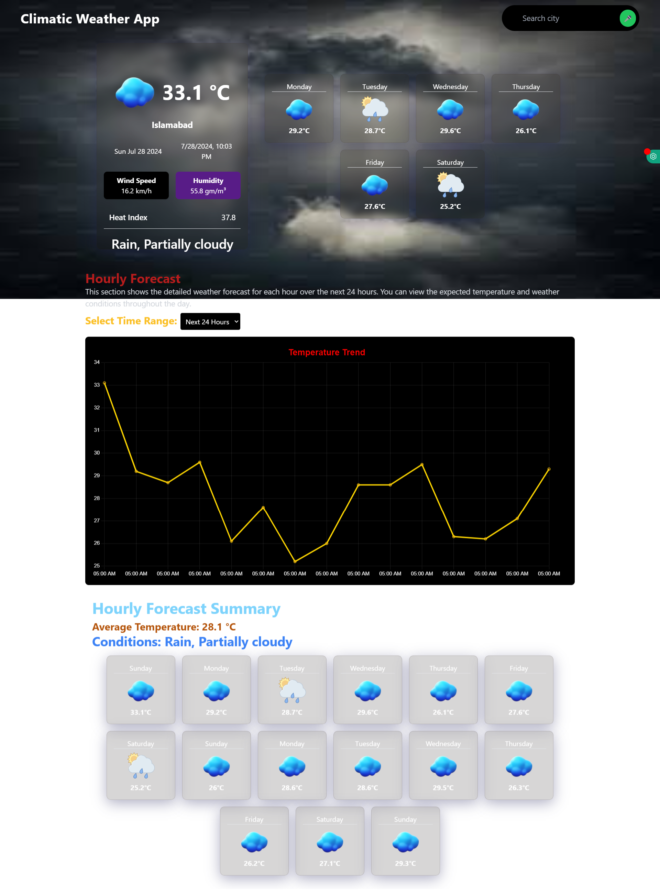
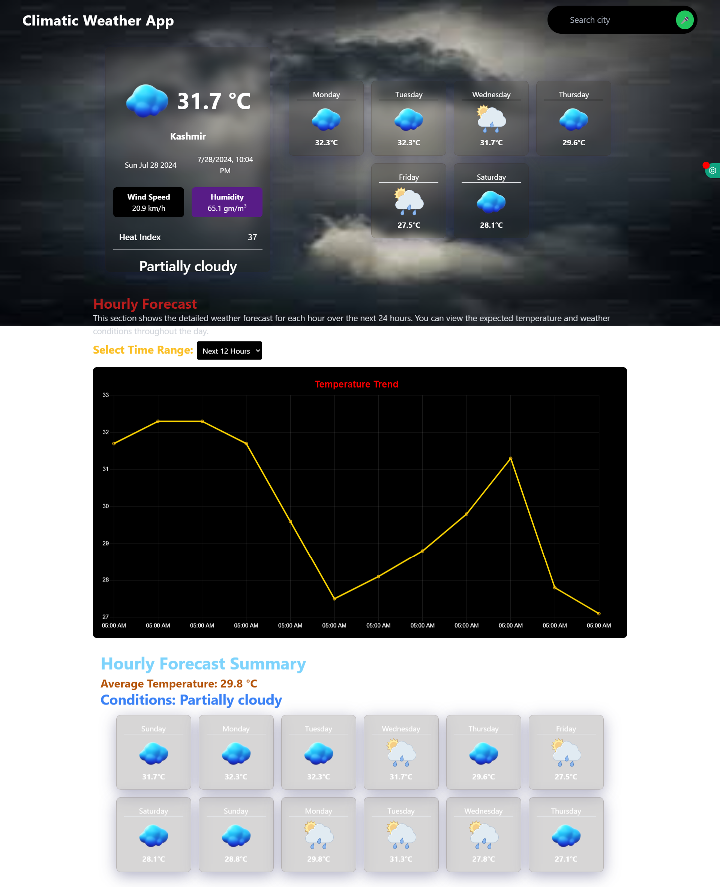

<h1 style="font-size: 2em; font-weight: bold;">🌦️ ForecastFusion Weather App 🌦️</h1>

 ForecastFusion Weather App! This modern online solution offers accurate and attractive weather forecasts. The goal of ForecastFusion is to become your daily go-to tool for checking up on current and  regional temperature forecasts, in a more concise view than what weather websites like Weather.com offer. ForecastFusion aims to be your one-stop shop for Daily weather updates and day Planning.

<h1 style="font-size: 2em; font-weight: bold;">🚀 Features </h1>
 
<h6 style="font-size: 2em; font-weight: bold;"> Current Weather: </h6> Get the current weather and temperature in real time.

<h6 style="font-size: 2em; font-weight: bold;"> Voice Search: </h6> Search for weather updates using voice commands 🎤.

<h6 style="font-size: 2em; font-weight: bold;"> Weather Map: </h6> Explore global weather conditions with interactive maps 🗺️.

<h6 style="font-size: 2em; font-weight: bold;"> Hourly and Daily Forecasts: </h6> View detailed hourly and daily forecasts.

<h6 style="font-size: 2em; font-weight: bold;"> Responsive Design: </h6> Enjoy a seamless experience across all devices, from mobile to desktop.

<h1 style="font-size: 2em; font-weight: bold;">🔧 Technologies Used </h1>
<h3 style="font-size: 2em; font-weight: bold;">Frontend 🌈 </h3>

<h6 style="font-size: 2em; font-weight: bold;"> React: </h6> For building the user interface.

<h6 style="font-size: 2em; font-weight: bold;"> Vite: </h6> For fast development and build tools.

<h6 style="font-size: 2em; font-weight: bold;"> Tailwind CSS: </h6> For styling the application.

<h3 style="font-size: 2em; font-weight: bold;">APIs 🌐 </h3>

<h6 style="font-size: 2em; font-weight: bold;"> OpenWeatherMap API: </h6> For fetching weather data.

<h6 style="font-size: 2em; font-weight: bold;"> React-Leaflet: </h6> For interactive weather maps.

<h1 style="font-size: 2em; font-weight: bold;">🎯 Getting Started </h1>

<h2 style="font-size: 2em; font-weight: bold;">Prerequisites </h2>

<h6 style="font-size: 2em; font-weight: bold;"> Node.js: </h6> Make sure your computer is running Node.js. It is available for download from nodejs.org.

<h6 style="font-size: 2em; font-weight: bold;"> API Key: </h6> Get an OpenWeatherMap API key, then configure it in your environment variables.

<h6 style="font-size: 2em; font-weight: bold;"> Create a .env file in the root directory and add: </h6>

RapidApikey=your_api_key (https://www.visualcrossing.com/weather-api)

<h2 style="font-size: 2em; font-weight: bold;">Installation</h2>

<h6 style="font-size: 2em; font-weight: bold;"> Clone the repository: </h6> git clone https://github.com/syedmaazsaeed/forecastfusion-weather-app.git

<h6 style="font-size: 2em; font-weight: bold;"> Navigate to the project directory: </h6>

cd forecastfusion-weather-app

<h2 style="font-size: 2em; font-weight: bold;">Install dependencies: <h2/>

npm install

<h6 style="font-size: 2em; font-weight: bold;"> Start the development server: </h6>

npm run dev

<h1 style="font-size: 2em; font-weight: bold;">🖼️ Screenshots </h1>

### Forecast View

<h2 style="font-size: 2em; font-weight: bold;">🤔 How It Works </h2>

<h6 style="font-size: 2em; font-weight: bold;"> Voice Search: </h6> Press 'Enter' or click the microphone button to start a voice search and get the most recent weather information.

<h6 style="font-size: 2em; font-weight: bold;"> Weather Map: </h6> Explore weather conditions globally with interactive maps.

<h6 style="font-size: 2em; font-weight: bold;"> Detailed Forecast: </h6> Get detailed hourly and daily forecasts for your selected location.

<h2 style="font-size: 2em; font-weight: bold;"> 🌐 Live Demo </h2>

<h6 style="font-size: 2em; font-weight: bold;"> Check out the live demo to see the **ForecastFusion Weather App** in action. Click the following link:

[See the Live Demo](https://forecastfusion-app.netlify.app/)

<h2 style="font-size: 2em; font-weight: bold;">🛠️🌟 Contributor </h2>

**Syed Maaz Saeed**  
Developer

